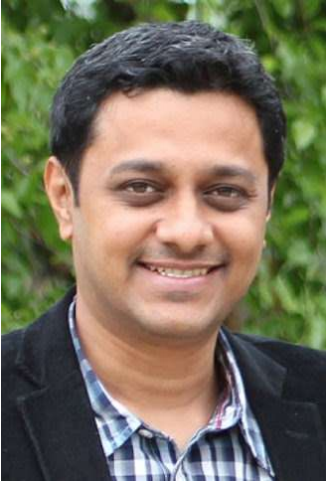
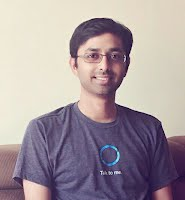
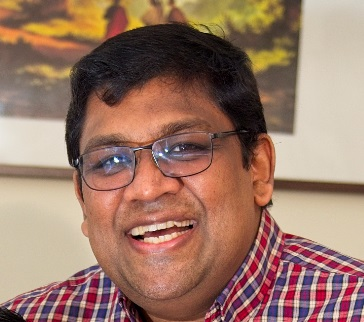
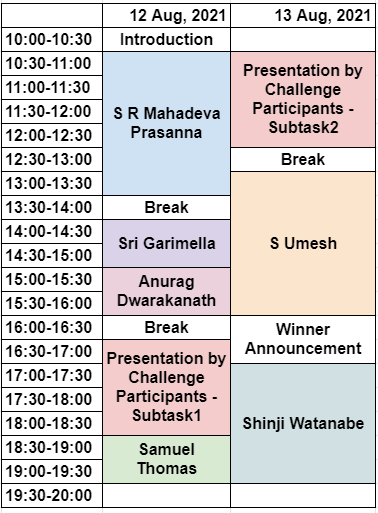

<!-- 

  

    <h1 style="color:white;">Keynotes</h1>
  

  -->

  <button class="tablinks" onclick="openCity(event, 'London')" id="defaultOpen">KEYNOTE</button>
  <button class="tablinks" onclick="openCity(event, 'Paris')">TENTATIVE PROGRAM</button>
  

<button class="collapsible">Anurag Dwarakanath (amazon) - Spoken Language Understanding for the Indic Region</button>

  
<strong>Title:</strong> Spoken Language Understanding for the Indic Region.

  
<strong>Abstract:</strong> In this talk, we will touch upon some of the key challenges in building Spoken Language Understanding systems for the Indic region. We begin with an insight on the usage of code-mixed multi-lingual utterances where many Indic languages (beyond Hindi) are freely used. We show how such Indic language usage gets represented in Latin script in a transliterated form and current state of the art multi-lingual language models (such as XLM-R, mBERT) surprisingly do not build common representations of transliterated text and that in the original language. We then introduce research in Continual Language Learning as an emerging area to bridge this gap. The Indic region also sees wide variety of spoken language variations including grammatical errors and ambiguous utterances leading to noise in data. We present recent progress in the area of Robust Machine Learning that aims to build learning algorithms that are resilient to noise in data. 

<strong>Bio:</strong> Anurag Dwarakanath is an applied science manager in Alexa AI and leads a team of scientists building machine learning and statistical models for the Natural Language Understanding components of Alexa. His interests include multi-lingual natural language processing, robustness in deep learning and verification & validation of deep learning systems. Anurag holds a PhD from Indian Institute of Management Calcutta where he studied the application of Graph Theory in Wireless Sensor Networks. Anurag has over 20 publications and 15 patents. 

  

<button class="collapsible">Shinji Watanabe</button>

  
<strong>Speakers:</strong> Shinji Watanabe and Pengcheng Guo

  
<strong>Title:</strong> Introduction of ESPnet, End-to-End Speech Processing Toolkit

<strong>Abstract:</strong> An end-to-end neural approach has become a popular alternative to conventional modular approaches in various speech applications including speech recognition and synthesis.
One of the benefits of this end-to-end neural framework is that we can use a unified framework for different speech processing problems based on sequence-to-sequence modeling. This tutorial aims to introduce various end-to-end speech processing applications by focusing on the above unified framework within an open source toolkit named ESPnet (End-to-end speech processing toolkit https://github.com/espnet/espnet). We will explain the recent advance of ESPnet, including conformer: convolution-augmented transformer, and show an example of making an ESPnet recipe to build a state-of-the-art ASR system. 

<strong>Short bio:</strong>

<strong>Shinji Watanabe</strong>

Shinji Watanabe is an Associate Professor at Carnegie Mellon University, Pittsburgh, PA. He received his B.S., M.S., and Ph.D. (Dr. Eng.) degrees from Waseda University, Tokyo, Japan. He was a research scientist at NTT Communication Science Laboratories, Kyoto, Japan, from 2001 to 2011, a visiting scholar in Georgia institute of technology, Atlanta, GA in 2009, and a senior principal research scientist at Mitsubishi Electric Research Laboratories (MERL), Cambridge, MA USA from 2012 to 2017. Prior to the move to Carnegie Mellon University, he was an associate research professor at Johns Hopkins University, Baltimore, MD USA from 2017 to 2020. His research interests include automatic speech recognition, speech enhancement, spoken language understanding, and machine learning for speech and language processing. He has been published more than 200 papers in peer-reviewed journals and conferences and received several awards, including the best paper award from the IEEE ASRU in 2019. He served as an Associate Editor of the IEEE Transactions on Audio Speech and Language Processing. He was/has been a member of several technical committees, including the APSIPA Speech, Language, and Audio Technical Committee (SLA), IEEE Signal Processing Society Speech and Language Technical Committee (SLTC), and Machine Learning for Signal Processing Technical Committee (MLSP).

<strong>Pengcheng Guo</strong>

Pengcheng Guo is a Ph.D. candidate at Northwestern Polytechnical University, Xi'an, China.
His supervisors are Prof. Lei Xie and Prof. Shinji Watanabe. From Jul. 2017 to Jul. 2018, he was a research assistant at Nanyang Technology University, Singapore, collaborating with Prof. Eng Siong Chng and Prof. Haizhou Li. From Apr. 2019 to Nov. 2019, he was a research intern at ByteDance AI Lab, Beijing, China, collaborating with Dr. Yuxuan Wang (the author of Tacotron). From Jan.2020 to Jan. 2021, he joined Shinji Watanabe’s team as a visiting scholar at Johns Hopkins University, Baltimore, US. His research interests include automatic speech recognition, domain adaptation, and adversarial training. He is the main developer of ESPnet and has contributed to a lot of projects, including the Conformer architecture, various ASR benchmark recipes, etc.

More details on the talk plan: <a href="https://docs.google.com/document/d/1ijipwXiqpkOocac-O4wrxuEGBR-v5rM4q3PMx4NwRD0/edit?usp=sharing">https://docs.google.com/document/d/1ijipwXiqpkOocac-O4wrxuEGBR-v5rM4q3PMx4NwRD0/edit?usp=sharing</a>

 

<button class="collapsible">Sri Garimella (on ASR part)</button>

  
<strong>Title:</strong> Overview of Speech Recognition Technology in Conversational Agents

  
<strong>Abstract:</strong> From the early days of modern Automatic Speech Recognition (ASR) research in the 1990s, one of the driving visions of the field has been a computer-based assistant that could accomplish tasks for the user, simply by being spoken to. Today, we are close to achieving that vision, with a whole array of speech-enabled AI agents eager to help users. Amazon’s Alexa pioneered the AI assistant concept for smart speaker devices enabled by far-field ASR. It currently supports billions of customer interactions per week, on over 100 million devices across multiple languages. This talk will give an overview of the interplay between underlying speech technologies, including wakeword detection, endpointing, speaker identification, and speech recognition that enable Alexa. We highlight successes and challenges in developing large-scale ASR, and dive into the unique data aspects of large-scale deployments like Alexa, where a continuous stream of unlabeled data enables successful applications of semi-supervised learning. Finally, we highlight problems that remain to be solved before the promise of a fully natural, conversational assistant is fully realized.

<strong>Bio:</strong> Sri Garimella is a senior manager of Applied Science, Alexa ASR in India. His team developed the ASR technology for launching Alexa in Indian English and Hindi languages. Sri obtained PhD from the Department of Electrical and Computer Engineering, Center for Language and Speech Processing at the Johns Hopkins University, Baltimore, USA in 2012. And Master of Engineering in Signal Processing from the Indian Institute of Science, Bangalore, India in 2006.

 

<button class="collapsible">Samuel Thomas</button>

  
<strong>Title:</strong> What next after ASR in Indian Languages? We speak in order to be understood!

  
<strong>Abstract:</strong> The MUCS 2021 challenge has focused on building multilingual and code-switching ASR systems for Indian languages in low resource settings. Within this challenge, teams have successfully tackled important problems and have demonstrated significant improvements on various languages. Where do these gains lead us next? If we speak in order to be understood, we advocate that the next frontier in this space is spoken language understanding (SLU). In this talk we will review recent work in end-to-end spoken language understanding, where the speech input is directly processed into intent without going through an intermediate text transcript. The lessons learnt in building ASR systems in low resource settings are extremely useful for this task too, as very often there is very limited SLU training data. We will share insights on training E2E SLU systems and the challenges ahead and how they can be applied for Indic languages.

<strong>Brief Bio:</strong> Samuel Thomas received his B.Tech degree in Computer Engineering from the Cochin University of Science and Technology, India (2000) and M.S degree in Computer Science and Engineering from the Indian Institute of Technology Madras, India (2006) before earning his Doctor of Philosophy degree from the Johns Hopkins University, Baltimore in 2012. Since graduation, he has been at the IBM T.J. Watson Research Center, New York with the Speech Technologies Group. In the past, he has worked on several speech research projects and workshops with the Center for Language and Speech Processing (CLSP) at JHU, the Idiap Research Institute, Switzerland and the TeNeT group, IIT Madras. His research interests include speech processing and machine learning for speech recognition, spoken language understanding, speech synthesis and speaker recognition.

 

<button class="collapsible">S R Mahadeva Prasanna</button>

  
<strong>Title: </strong>Speech Processing: Handcrafted features to Deep Representations

  
<strong>Abstract: </strong>With the advent of deep learning to the speech processing field for about a decade, a lot of attempts have been made towards learning the representations from spectrographic representation of speech. These representations are based on nonlinear processing and
seem to capture more information from speech. The other mostly practised approach is handcrafted features extracted using signal processing and linked to speech production and/or perception. These approaches are mostly based on linear processing and are mathematically tractable.  This talk will take through the journey of speech processing from earliest explorations of handcrafted features to the latest deep representations. 

<strong>Brief:</strong> Dr. S. R. M. Prasanna is Dean (Faculty Welfare, Research and Development) and Professor, Dept of Electrical Engineering at IIT Dharwad since July 2017. He was faculty member at the Dept of Electronics and Electrical Engineering at IIT Guwahati from August 2004 to July 2017. He was also Dean (Research and Development) from July 2015 to July 2017 at IIT Guwahati. He
obtained his PhD in CSE from IIT Madras in 2004, MTech in Industrial Electronics from NITK Surathkal in 1997 and BE in Electronics from SSIT Tumakuru (then with Bangalore University) in 1994. He has guided 20 PhD Theses and 12 ongoing in the areas of Speech and Handwriting processing. He has published over 250 research articles in reputed Indian and International journals and conferences. He has executed large volume funded projects and also provided consultancy to many public sector and private limited companies
in the areas of speech processing.

 

<button class="collapsible">Umesh - modeling HMM to e2e</button>

  
<strong>Title:</strong> Automatic Speech Recognition using Models from GMM-HMM  to Transformers to wav2vec2.0

  
<strong>Abstract:</strong> In this talk, I will give an overview of various models used in Automatic Speech Recognition. After a brief overview of conventional GMM-HMM models and the role of lexicon and language models, I will talk about the recent progress based on deep-learning methods. This will include DNN-HMM and CTC based approaches. This will be followed by the sequence-to-sequence approaches including Attention-Based Encoder Decoder as well as transformers. Finally, I will talk about self-supervised approaches that are inspired by BERT, GPT and contrastive predictive coding including methods like MockingJay, Wav2vec and HuBERT.

 

